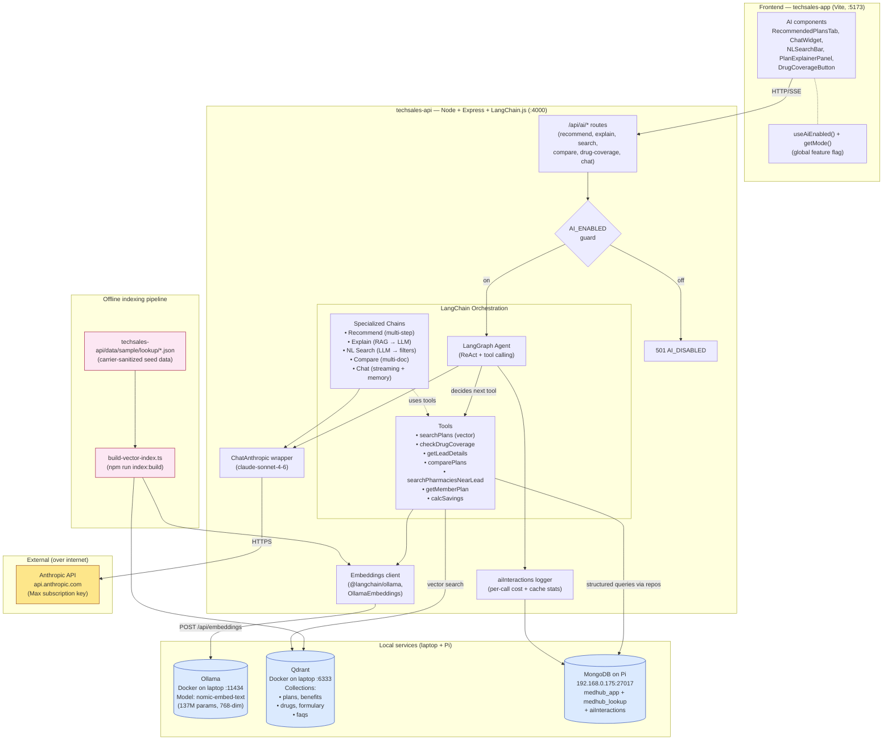

# Medicare Hub — End-to-End AI Pipeline (LangChain.js + Qdrant + Claude)

## Context

The previous AI plan (direct Anthropic prompt-caching with no vector DB) is replaced. This POC needs to **showcase a real end-to-end AI pipeline** — embeddings, vector retrieval, agent orchestration with tool calling — built entirely on open-source tools running on existing hardware (laptop + Pi), with Claude as the LLM via the user's Anthropic Max subscription. No GCP, no Vertex, no paid managed services.

The 6 user-facing features stay the same; what changes is **how** they work:
- Lead-triggered Plan Recommendation
- Plan Explainer (agent + member modes)
- Natural-Language Plan Search
- Natural-Language Plan Comparison
- Drug Coverage Q&A
- Member Portal Chat

But under the hood: **LangGraph agents with tool calling** that hit a **Qdrant vector store** populated by **local embedding generation**, with **Claude** as the reasoning LLM. The agent doesn't just answer from a stuffed prompt — it decides which tools to invoke (vector search, structured DB queries, formulary lookups, eligibility checks), composes results, and synthesizes the final response.

---

## Architecture Diagram



**Key flow for a recommendation request:**
1. Frontend → `POST /api/ai/recommend { leadId }`
2. Express route → AI_ENABLED guard → LangGraph agent
3. Agent reads system prompt, plans tool calls
4. Agent invokes `getLeadDetails(leadId)` → repository registry → MongoDB
5. Agent invokes `searchPlans(zipCode, profile)` → query text sent to **Ollama** (`nomic-embed-text`, 768-dim) → vector returned → Qdrant ANN top-K
6. Agent invokes `checkDrugCoverage(plansK, drugIds)` → formulary collection in Qdrant + structured rules
7. Agent invokes `calcSavings(plans, premium adjustments)` → pure JS
8. Agent calls Claude with retrieved context → ranked recommendations + rationale
9. Audit log → `aiInteractions` collection in `medhub_app`
10. Response → Frontend renders RecommendedPlansTab

---

## Stack — open-source / free / your-existing

| Layer | Choice | Why |
|---|---|---|
| Orchestration | **LangChain.js** + **LangGraph** | Modern TS-native agent framework; runs in same process as Express. Tool calling, streaming, memory, RAG primitives all first-class. |
| Vector DB | **Qdrant** in Docker (on laptop) | Best open-source vector DB. Official `@qdrant/js-client-rest`. Filterable payload, ANN via HNSW. ~50 MB RAM idle. Single container. |
| Embedding service | **Ollama** running `nomic-embed-text` (Docker, :11434) | Standalone open-source embedding service. nomic-embed-text is 137M params, **768-dim**, fully open weights (Apache-2.0), beats OpenAI's `text-embedding-ada-002` on MTEB benchmarks. Same Ollama instance can later serve local LLMs (Llama, Qwen) if you ever want to fully de-cloud. ~274MB model download (Q4 quantized). LangChain.js: `@langchain/ollama` `OllamaEmbeddings`. Per-query latency ~30-50ms on laptop CPU. |
| LLM | **Claude (Sonnet 4.6 default, Opus 4.7 for explainer)** via Anthropic API | User has Max subscription = API key. Direct calls, not Vertex Model Garden. `@langchain/anthropic` adapter. |
| Audit log | **MongoDB on Pi** — `medhub_app.aiInteractions` collection | Already exists. Tracks: kind, input, output, model, tokensIn/cachedIn/Out, latency, error, createdAt. |
| Reranking (optional) | **In-LLM via Claude** | Pass top-K candidates to Claude with "rank these N for relevance". Avoids needing a separate cross-encoder. Phase 5 polish. |
| Hybrid search | **BM25-lite via `wink-bm25-text-search`** + vector | Pure JS, no native deps. Lexical + semantic blended at retrieval time for "find plans with dental in Florida" queries. |
| Streaming | LangChain.js `streamEvents` → Express SSE | Native to LangChain.js. Surfaces token deltas + tool-call events to FE. |

**Nothing on this list costs money or requires a cloud account beyond the Anthropic API key you already have.**

---

## Why this is "real AI pipeline" not just LLM calls

This POC showcases end-to-end AI capabilities. The architecture deliberately includes:

1. **A real vector store** (Qdrant), not a stuffed-prompt hack. Demonstrates retrieval at scale.
2. **A real embedding pipeline** with a real local embedder. The team can swap models by changing one line.
3. **Agent tool calling** — Claude decides which tools to invoke based on the user's intent. Not a fixed prompt template. Demonstrably "agentic": can chain tool calls, recover from errors, re-plan.
4. **Hybrid retrieval** — semantic + lexical. Real-world RAG quality requires both.
5. **Explainable execution** — the agent's tool-call trace is logged to `aiInteractions`. Stakeholders see *why* the answer is what it is.
6. **Streaming with intermediate events** — chat shows tool selections as they happen ("Searching plans... Checking drug coverage... Composing recommendation"). Powerful demo affordance.

---

## Phased Implementation

### Phase 0 — Local infrastructure (~30 min)

**Goal:** Qdrant + Ollama running locally, embedding model downloaded, Anthropic key works.

```powershell
# Qdrant (vector DB)
docker run -d --name qdrant -p 6333:6333 -p 6334:6334 -v qdrant_storage:/qdrant/storage qdrant/qdrant
curl http://localhost:6333/healthz

# Ollama (embedding service)
docker run -d --name ollama -p 11434:11434 -v ollama:/root/.ollama ollama/ollama
docker exec -it ollama ollama pull nomic-embed-text     # ~274MB
curl http://localhost:11434/api/tags

# Embedder smoke test → expect 768-dim vector
curl http://localhost:11434/api/embeddings -d '{"model":"nomic-embed-text","prompt":"hello world"}'

# Anthropic key — paste into techsales-api/.env
ANTHROPIC_API_KEY=sk-ant-...
```

### Phase 1 — Pipeline foundation (echo agent + audit log)

Bare-bones LangGraph agent runs end-to-end with one trivial tool, logging to `aiInteractions`.

**Backend:**
- `npm install langchain @langchain/anthropic @langchain/core @langchain/community @langchain/langgraph @langchain/ollama @qdrant/js-client-rest wink-bm25-text-search`
- `src/ai/llm/chatAnthropic.ts` — Claude wrapper, model selection, audit callback injection
- `src/ai/llm/callbacks.ts` — `LangChainCallbackHandler` writing to `aiInteractions`
- `src/ai/embeddings/ollamaEmbedder.ts` — `OllamaEmbeddings` from `@langchain/ollama`
- `src/ai/vectorstore/qdrantClient.ts` — connection helpers
- `src/models/aiInteraction.model.ts` (Mongoose, lazy accessor)
- `src/repositories/{mongo,json}/AiInteractionRepository.ts` — write-mostly
- `src/repositories/registry.ts` — wire `aiInteraction`
- `src/ai/agents/echoAgent.ts` — minimal LangGraph: one tool + one Claude call
- `src/controllers/ai.controller.ts` — `POST /api/ai/echo`
- `src/routes/ai.routes.ts` — guard + echo route
- `src/routes/health.routes.ts` — extend with `aiEnabled: boolean`

**Frontend:**
- `src/api/aiClient.ts` — fetch + SSE wrappers
- `src/api/mode.ts` — extend `probeBackendMode` to also pull `aiEnabled`
- `src/context/AuthContext.tsx` — store + expose `aiEnabled`
- `src/hooks/useAiEnabled.ts`
- `src/types/ai.ts` — type skeleton

**Acceptance:**
- `curl POST /api/ai/echo -d '{"text":"hi"}'` returns LLM-rephrased text
- `db.aiInteractions.find()` shows one entry with `tokensIn`, `tokensOut`, `latencyMs`, `model`, `toolCalls: [{name:'echo', input, output}]`
- `AI_ENABLED=false` → 501; `/api/health.aiEnabled` → false
- FE `tsc --noEmit` clean; `useAiEnabled()` returns true in dev

### Phase 2 — Index pipeline + retrieval primitives

**Backend:**
- `src/ai/vectorstore/collections.ts` — schemas for `plans`, `benefits`, `drugs`, `formulary`, `faqs`
- `src/ai/vectorstore/hybridRetriever.ts` — BM25 (wink) + Qdrant ANN, RRF fusion (k=60)
- `src/scripts/build-vector-index.ts` — reads `data/sample/lookup/*.json`, generates payload texts, embeds, upserts. Idempotent.
- `data/formulary-synthetic.json` — generated via `src/scripts/build-formulary.ts` (deterministic seed)
- `src/ai/tools/searchPlans.tool.ts` — first real tool
- `src/scripts/query-qdrant.ts` — debug CLI

**Acceptance:** `npm run index:build` populates Qdrant; query returns top-5 plans for "low premium HMO Florida".

### Phase 3 — Recommend agent (Feature #1)

**Backend:**
- Tools: `getLeadDetails`, `searchPharmaciesNearLead`, `checkDrugCoverage`, `comparePlans`, `calcSavings`, `getMemberPlan`
- `src/ai/agents/recommendAgent.ts` — LangGraph workflow:
  1. `getLeadDetails(leadId)` → fetch profile
  2. `searchPlans(zip, lead.profile)` → vector retrieval
  3. `checkDrugCoverage(planIds, drugIds)` → Qdrant batch lookup
  4. `calcSavings(plans)` → estimated annual cost
  5. Claude call: rank with rationale, JSON output
  6. zod-validate; retry once on parse fail
- `POST /api/ai/recommend`

**Frontend:**
- `aiService.recommend(leadId)`, `recommendationCache` (24h TTL)
- `RecommendedPlansTab.tsx`
- `LeadForm.tsx:324` — fire-and-forget after create
- `LeadDetail.tsx:156` — insert "Recommended Plans" tab (gated)
- `PlanRecommendations.tsx` — replace mock with `aiService.recommend()`

**Acceptance:** Create FL lead with Medicaid + 2 drugs → tab shows 5 ranked plans within ~5s.

### Phase 4 — Explain + Search + Compare + Drug Coverage agents

- `explainAgent` — single-plan RAG (vector → top-K → LLM compose). Modes: `agent` / `member`. Streaming.
- `searchAgent` — Claude parses NL → structured filters JSON → hybrid retriever
- `compareAgent` — multi-plan retrieval + diff narrative
- `drugCoverageAgent` — single tool wrap; Claude composes user-friendly answer

FE: `PlanExplainerPanel.tsx`, `NLSearchBar.tsx` + `FilterChipRow.tsx`, `PlanCompare.tsx` + `ComparisonGrid.tsx` (extracted from YOY), `DrugCoverageButton.tsx` + `DrugCoverageModal.tsx`. Modify `LeadDetail` Drugs tab, `PlanList:275` search swap, `PlanDetail:131` AI Explainer tab, `MemberPlanDetail` modal, `App.tsx` /plans/compare route.

### Phase 5 — Member chat widget (Feature #6) + streaming

- `chatAgent` — LangGraph with conversation memory + ALL tools available. SSE streaming.
- Express SSE handler with `flushHeaders()`, `X-Accel-Buffering: no`, 15s keepalive
- `ChatWidget.tsx` — floating panel (380×560), theme-aware, `AbortController` for in-flight
- `ChatToolTrace.tsx` — shows "🔍 Searching plans..." while tools run
- `useChatHistory.ts` — localStorage by `memberId`, last 50 msgs
- Mount in `MemberDashboard.tsx`

### Phase 6 — Hardening + observability

- Per-user rate limit (`express-rate-limit` keyed by userId/memberId)
- Daily token cap from `aiInteractions` (filter `provider:'anthropic'`)
- Cache hit ratio observability — log `cache_creation_input_tokens` + `cache_read_input_tokens`
- Banners: "AI may be inaccurate", "Simulated formulary"
- CI guard regex extended to `src/ai/prompts/**`
- Theme + dark mode audit

---

## Modular Flag

**Backend env** (`techsales-api/src/config/env.ts`):
```ts
AI_ENABLED: boolean (default true)        // master switch — disables /api/ai/* with 501
ANTHROPIC_API_KEY: string                 // required when AI_ENABLED=true
AI_MODEL_DEFAULT: 'claude-sonnet-4-6'
AI_MODEL_PREMIUM: 'claude-opus-4-7'
AI_MAX_DAILY_TOKENS: 5_000_000

QDRANT_URL: 'http://localhost:6333'
OLLAMA_URL: 'http://localhost:11434'
AI_EMBED_MODEL: 'nomic-embed-text'
AI_EMBED_DIM: 768

AI_MAX_TOOL_STEPS: 8                      // agent runaway guard
AI_REQUEST_TIMEOUT_MS: 60_000
```

**Frontend env** (`techsales-app/.env.local`):
```
VITE_AI_ENABLED=true
```

**`useAiEnabled()` hook** reads three signals — env + getMode + serverFlag (from /api/health). Components return `null` when false; no half-mounted state, no late 501s.

---

## Open Risks

1. **Ollama cold start** — ~3-5s first call after `docker run`. Mitigation: `OLLAMA_KEEP_ALIVE=24h`, server-boot warm-up call.
2. **Local services SPOF** — Qdrant + Ollama on laptop; future move to Pi (both ARM64-ready).
3. **nomic-embed-text quality** — 768-dim, MTEB ~62. Swap to `mxbai-embed-large` (1024-dim, MTEB 64) or `bge-m3` if needed.
4. **Agent runaway loops** — `AI_MAX_TOOL_STEPS=8` cap + `AI_REQUEST_TIMEOUT_MS=60_000`.
5. **Carrier-name leakage in prompts** — devs hand-write prompt files. CI grep extended to `src/ai/prompts/**`.
6. **Streaming chat abort** — `AbortController` FE-side + `req.on('close')` server-side.
7. **Tool errors propagate to user** — every tool wraps body in try/catch, returns `{ ok: false, error }`. Agent prompt instructs Claude to handle gracefully.

---

## Open items (resolve during execution)

1. **Anthropic API key** — confirm Max subscription provides a usable `ANTHROPIC_API_KEY`. Claude Code's OAuth flow does not expose a key the backend can call directly; user typically generates a separate Anthropic Console key (https://console.anthropic.com/settings/keys) which Max-tier credits cover.
2. **Embedder upgrade path** — start with `nomic-embed-text`. Swap to `mxbai-embed-large` or `bge-m3` if retrieval quality is poor. Qdrant collections recreated on dimension change.
3. **Hybrid retrieval weights** — RRF default `k=60` works generically. May need per-collection tuning.
4. **Pi as Ollama / Qdrant host** — ARM64 builds available. Phase 7 stretch.
