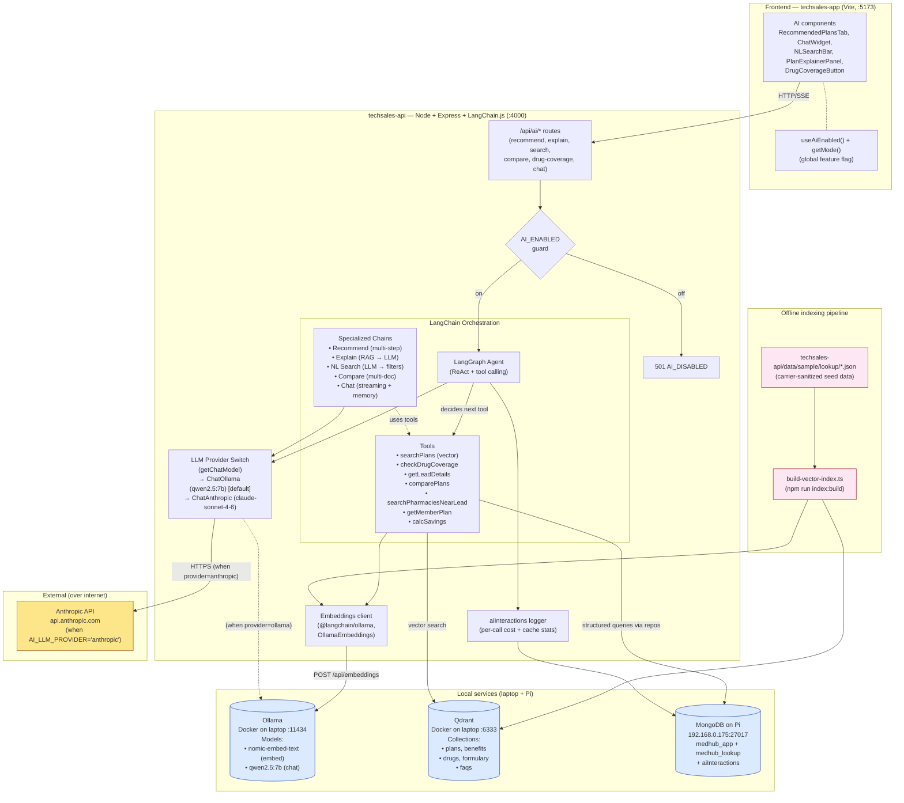

# Medicare Hub — End-to-End AI Pipeline (LangChain.js + Qdrant + Claude)

## Context

The previous AI plan (`AI_BACKEND_PLAN.md`, direct Anthropic prompt-caching with no vector DB) is replaced. This POC needs to **showcase a real end-to-end AI pipeline** — embeddings, vector retrieval, agent orchestration with tool calling — built entirely on open-source tools running on existing hardware (laptop + Pi), with Claude as the LLM via the user's Anthropic Max subscription. No GCP, no Vertex, no paid managed services.

The 6 user-facing features stay the same; what changes is **how** they work:
- Lead-triggered Plan Recommendation
- Plan Explainer (agent + member modes)
- Natural-Language Plan Search
- Natural-Language Plan Comparison
- Drug Coverage Q&A
- Member Portal Chat

But under the hood: **LangGraph agents with tool calling** that hit a **Qdrant vector store** populated by **local embedding generation**, with **Claude** as the reasoning LLM. The agent doesn't just answer from a stuffed prompt — it decides which tools to invoke (vector search, structured DB queries, formulary lookups, eligibility checks), composes results, and synthesizes the final response.

---

## Architecture Diagram



**Key flow for a recommendation request:**
1. Frontend → `POST /api/ai/recommend { leadId }`
2. Express route → AI_ENABLED guard → LangGraph agent
3. Agent reads system prompt, plans tool calls
4. Agent invokes `getLeadDetails(leadId)` → repository registry → MongoDB
5. Agent invokes `searchPlans(zipCode, profile)` → query text sent to **Ollama** (`nomic-embed-text`, 768-dim) → vector returned → Qdrant ANN top-K
6. Agent invokes `checkDrugCoverage(plansK, drugIds)` → formulary collection in Qdrant + structured rules
7. Agent invokes `calcSavings(plans, premium adjustments)` → pure JS
8. Agent calls **getChatModel()** with retrieved context → either qwen2.5:7b on Ollama (free) or Claude Sonnet on Anthropic API → ranked recommendations + rationale
9. Audit log → `aiInteractions` collection in `medhub_app`
10. Response → Frontend renders RecommendedPlansTab

---

## Stack — open-source / free / your-existing

| Layer | Choice | Why |
|---|---|---|
| Orchestration | **LangChain.js** + **LangGraph** | Modern TS-native agent framework; runs in same process as Express. Tool calling, streaming, memory, RAG primitives all first-class. |
| Vector DB | **Qdrant** in Docker (on laptop) | Best open-source vector DB. Official `@qdrant/js-client-rest`. Filterable payload, ANN via HNSW. ~50 MB RAM idle. Single container. |
| Embedding service | **Ollama** running `nomic-embed-text` (Docker, :11434) | Standalone open-source embedding service. nomic-embed-text is 137M params, **768-dim**, fully open weights (Apache-2.0). ~274MB model download. LangChain.js: `@langchain/ollama` `OllamaEmbeddings`. ~30-50ms/query on laptop CPU. |
| LLM | **Switchable provider** via `AI_LLM_PROVIDER` env (`ollama` or `anthropic`). Defaults to **Ollama running `qwen2.5:7b`** (free, local). Flips to **Claude (Sonnet 4.6 / Opus 4.7)** when key + balance present. | The user wants free out-of-box AND the option to upgrade to Claude when ready to pay for tokens. Single chokepoint at `getChatModel()`; agents are provider-agnostic. `@langchain/ollama` `ChatOllama` for local; `@langchain/anthropic` `ChatAnthropic` for cloud. Both already installed. |
| Audit log | **MongoDB on Pi** — `medhub_app.aiInteractions` collection | Tracks: kind, input, output, model, tokensIn/cachedIn/Out, latency, error, createdAt. |
| Hybrid search | **BM25-lite via `wink-bm25-text-search`** + vector | Pure JS, no native deps. Lexical + semantic blended at retrieval time. |
| Streaming | LangChain.js `streamEvents` → Express SSE | Native to LangChain.js. Surfaces token deltas + tool-call events to FE. |

**Nothing on this list costs money** (default config). Anthropic credits are an opt-in upgrade path.

---

## Why this is "real AI pipeline" not just LLM calls

This POC showcases end-to-end AI capabilities. The architecture deliberately includes:

1. **A real vector store** (Qdrant), not a stuffed-prompt hack.
2. **A real embedding pipeline** with a real local embedder.
3. **Agent tool calling** — the LLM decides which tools to invoke. Demonstrably "agentic": chains tool calls, recovers from errors, re-plans.
4. **Hybrid retrieval** — semantic + lexical.
5. **Explainable execution** — tool-call trace logged to `aiInteractions`.
6. **Streaming with intermediate events** — chat shows tool selections live ("Searching plans... Checking drug coverage... Composing recommendation").

---

## Modular flag — exact implementation

**Backend** (`techsales-api/src/config/env.ts`):
```ts
// Master switch — disables /api/ai/* entirely
AI_ENABLED: z.coerce.boolean().default(true),

// LLM provider switch (Phase 7 add)
AI_LLM_PROVIDER: z.enum(['ollama', 'anthropic']).default('ollama'),

// Anthropic (used when AI_LLM_PROVIDER='anthropic')
ANTHROPIC_API_KEY: z.string().optional(),  // only required when provider='anthropic'
AI_MODEL_DEFAULT: z.string().default('claude-sonnet-4-6'),
AI_MODEL_PREMIUM: z.string().default('claude-opus-4-7'),

// Ollama chat models (used when AI_LLM_PROVIDER='ollama')
OLLAMA_LLM_MODEL: z.string().default('qwen2.5:7b'),
OLLAMA_LLM_PREMIUM_MODEL: z.string().default('qwen2.5:7b'),  // bump to 14b if user has GPU/patience

AI_MAX_DAILY_TOKENS: z.coerce.number().default(5_000_000),  // applies to anthropic only; ollama is free

// Vector store
QDRANT_URL: z.string().default('http://localhost:6333'),
QDRANT_API_KEY: z.string().optional(),

// Embeddings (Ollama)
OLLAMA_URL: z.string().default('http://localhost:11434'),
AI_EMBED_MODEL: z.string().default('nomic-embed-text'),
AI_EMBED_DIM: z.coerce.number().default(768),

// Behavior
AI_MAX_TOOL_STEPS: z.coerce.number().default(8),  // agent runaway guard
AI_REQUEST_TIMEOUT_MS: z.coerce.number().default(60_000),
AI_PREWARM_AT_BOOT: z.coerce.boolean().default(false),

// Phase 6 — per-user/IP rate limiting on /api/ai/* (echo exempt).
AI_RATE_LIMIT_MAX: z.coerce.number().int().positive().default(30),
AI_RATE_LIMIT_WINDOW_MS: z.coerce.number().int().positive().default(300_000),
```

When `AI_ENABLED=false`, a guard middleware at `routes/ai.routes.ts` returns:
```json
{ "success": false, "error": "AI features are disabled", "code": "AI_DISABLED" }
```
with HTTP 501. The same flag is exposed via `/api/health` so the frontend knows at session start.

**Frontend** (`techsales-app/.env.local`):
```
VITE_AI_ENABLED=true
```

**`useAiEnabled()` hook** — reads three signals: `VITE_AI_ENABLED` env + `getMode() === 'api'` + serverFlag (from /api/health). Components return `null` when this is false. **No half-mounted state, no surprise 501s on click.**

---

## Phased Implementation

### Phase 0 — Local infrastructure (~30 min, BEFORE Phase 1)

```powershell
# Qdrant (vector DB)
docker run -d --name qdrant -p 6333:6333 -p 6334:6334 -v qdrant_storage:/qdrant/storage qdrant/qdrant
curl http://localhost:6333/healthz

# Ollama (embedding service + chat models)
docker run -d --name ollama -p 11434:11434 -v ollama:/root/.ollama ollama/ollama
docker exec ollama ollama pull nomic-embed-text   # ~274MB, embedding model
docker exec ollama ollama pull qwen2.5:7b         # ~4.7GB, chat model (Phase 7 default)

# Anthropic key — OPTIONAL; only needed when flipping AI_LLM_PROVIDER=anthropic
# ANTHROPIC_API_KEY=sk-ant-... in techsales-api/.env
```

### Phase 1 — Pipeline foundation

Bare-bones LangGraph agent runs end-to-end with one trivial tool, logging to `aiInteractions`.

**Backend:** install `langchain @langchain/anthropic @langchain/core @langchain/community @langchain/langgraph @langchain/ollama @qdrant/js-client-rest wink-bm25-text-search`. Build `chatModel.ts` (Phase 7 will refactor to provider-switch), `callbacks.ts` audit handler, `ollamaEmbedder.ts`, `qdrantClient.ts`, `aiInteraction` Mongoose model + Mongo + JSON repos, `echoAgent.ts` minimal LangGraph, `ai.controller.ts` echo handler, `ai.routes.ts` with AI_ENABLED guard, `health.routes.ts` extended with `aiEnabled`.

**Frontend:** `aiClient.ts`, `mode.ts` extension, `useAiEnabled.ts` hook, `AuthContext.tsx` extension, `types/ai.ts` skeleton.

**Acceptance:** `POST /api/ai/echo` returns LLM-rephrased text, audit row written. `AI_ENABLED=false` → 501.

### Phase 2 — Index pipeline + retrieval primitives

Vector store collections (`plans`, `benefits`, `drugs`, `formulary`, `faqs`). Hybrid retriever (BM25 + Qdrant + RRF k=60). `build-vector-index.ts` script. Synthetic formulary generator. `searchPlans` tool. Debug query CLI.

**Acceptance:** 80 plans / 1487 benefits / 50 drugs / 4000 formulary entries indexed; vector query returns sensible top-5.

### Phase 3 — Recommend agent (Feature #1)

5 new tools: `getLeadDetails`, `checkDrugCoverage`, `calcSavings`, `comparePlans`, `getMemberPlan`. `recommendAgent` LangGraph workflow. `/api/ai/recommend` route. FE: `aiService.recommend`, `recommendationCache`, `RecommendedPlansTab`, fire-and-forget on lead create, "Recommended Plans" tab on LeadDetail, replace PlanRecommendations mock.

**Acceptance:** Create FL/Medicaid/2-drug lead → tab shows 5 ranked plans within ~5s.

### Phase 4 — Explain + Search + Compare + Drug Coverage agents

- `explainAgent` — single-plan RAG, agent + member modes, streaming
- `searchAgent` — NL → structured filters → hybrid retriever
- `compareAgent` — multi-plan diff narrative
- `drugCoverageAgent` — single tool wrap with banner

FE: `PlanExplainerPanel`, `NLSearchBar` + `FilterChipRow`, `ComparisonGrid` (extracted from YOY), `PlanCompare` page, `DrugCoverageButton` + `Modal`.

### Phase 5 — Member chat widget (Feature #6) + streaming

- `chatAgent` — LangGraph with conversation memory + ALL tools, SSE streaming
- Express SSE handler with `flushHeaders()`, `X-Accel-Buffering: no`, 15s keepalive
- `ChatWidget` floating panel, `AbortController` for in-flight, `ChatToolTrace` live "🔍 Searching plans...", `useChatHistory` localStorage by memberId
- Mount in `MemberDashboard`

### Phase 6 — Hardening + observability

- Per-user rate limit (`express-rate-limit` keyed by userId/memberId)
- Daily token cap from `aiInteractions`
- Cache hit ratio observability
- Banners ("AI may be inaccurate", "Simulated formulary")
- CI guard regex extended to `src/ai/prompts/**`
- Theme + dark mode audit

### Phase 7 — LLM provider abstraction (switchable Ollama / Anthropic) ← **NEW, executes after Phase 6**

**Goal:** Decouple agents from a specific LLM. Default to free local Ollama; flip to Anthropic with one env var when ready to spend tokens.

**Context:** Phase 1 hardcoded `getChatModel()` to `ChatAnthropic` in `techsales-api/src/ai/llm/chatAnthropic.ts`. All 7 agents use that single factory. The user's Anthropic Console balance is $0 (Max subscription does NOT include API credits) so the recent live smoke returned `400 invalid_request_error: Your credit balance is too low`. We need a free path AND the cloud option preserved.

**Design — single chokepoint, two providers:**

```
techsales-api/src/ai/llm/
├── chatModel.ts                  RENAMED from chatAnthropic.ts
│                                 — exports getChatModel() that dispatches on AI_LLM_PROVIDER
│                                 — exports getProviderReadinessError() for the controller pre-flight
│                                 — exports getActiveProvider() for /api/health
├── providers/
│   ├── anthropic.ts              extracted ChatAnthropic instantiation (current logic)
│   └── ollama.ts                 NEW — ChatOllama instantiation, no key needed
└── callbacks.ts                  unchanged (audit handler is provider-agnostic)
```

`getChatModel()` returns `BaseChatModel` (parent type of both `ChatAnthropic` and `ChatOllama`) so callers don't need to change types. Premium tier flag still works:
- anthropic + premium → `claude-opus-4-7`
- ollama + premium → `OLLAMA_LLM_PREMIUM_MODEL` (default same as default model; bump to `qwen2.5:14b` if user has GPU)

**Backend touchpoints:**

- `src/config/env.ts` — add `AI_LLM_PROVIDER`, `OLLAMA_LLM_MODEL`, `OLLAMA_LLM_PREMIUM_MODEL`. `ANTHROPIC_API_KEY` becomes only-required-when `AI_LLM_PROVIDER='anthropic'`.
- `src/ai/llm/chatAnthropic.ts` → rename to `chatModel.ts`; extract Anthropic logic to `providers/anthropic.ts`; add `providers/ollama.ts`.
- 7 agents: change `import { getChatModel } from '../llm/chatAnthropic.js'` → `'../llm/chatModel.js'`. Mechanical sed.
- `src/controllers/ai.controller.ts` — replace 4 inline `if (!ANTHROPIC_API_KEY)` checks with one call to `getProviderReadinessError()`. The 503 message becomes provider-aware.
- `src/routes/health.routes.ts` — extend payload with `aiProvider: env.AI_LLM_PROVIDER`. FE can show this.
- `.env.example` — document the new vars; mark `AI_LLM_PROVIDER=ollama` as default.

**Frontend (optional, Phase 7 polish):**

- `techsales-app/src/api/mode.ts` — extend `probeBackendMode` to also pull `aiProvider` from `/api/health`.
- `techsales-app/src/components/layout/Header.tsx` — small badge: "AI: Ollama" (green) vs "AI: Claude" (purple).

**Phase 0 add-on:** pull the chat model into Ollama (already done above):

```powershell
docker exec ollama ollama pull qwen2.5:7b   # ~4.7GB, one-time
docker exec ollama ollama list              # verify
```

**Acceptance:**

1. `AI_LLM_PROVIDER=ollama` (default), no Anthropic key:
   - `/api/health` returns `aiEnabled: true, aiProvider: 'ollama'`
   - `POST /api/ai/echo {"text":"hi"}` returns 200 with rephrased text from qwen2.5:7b
   - `aiInteractions` row shows `provider: 'ollama'`, `model: 'qwen2.5:7b'`
2. `AI_LLM_PROVIDER=anthropic` + valid `ANTHROPIC_API_KEY` + balance:
   - Same call returns 200 from Claude Sonnet
   - `aiInteractions` row shows `provider: 'anthropic'`, `model: 'claude-sonnet-4-6'`
3. `AI_LLM_PROVIDER=anthropic` + missing/empty key:
   - 503 with provider-aware message: "AI provider is 'anthropic' but ANTHROPIC_API_KEY is not set. Either set the key or change AI_LLM_PROVIDER to 'ollama'."
4. `AI_LLM_PROVIDER=anthropic` + valid key + zero balance (current state):
   - 502/500 with the upstream Claude error pass-through (existing controller error mapping handles this)
5. CI guard still clean — no real carrier names introduced.
6. Build clean on both BE and FE.

**Open quality risks (qwen2.5:7b vs Claude):**

- Tool-call reliability: qwen2.5:7b is the strongest 7B for tool calling but still 1-2 generations behind Claude Sonnet. Multi-step ReAct agents (recommend = 5 tool calls) may occasionally pick wrong tools or skip steps. Existing `try/catch` per tool returning `{ ok: false }` + agent prompt instructs LLM to handle gracefully. Real-world success rate: ~75-90% expected on qwen vs ~95-98% on Claude.
- JSON parse on structured output: qwen sometimes wraps in markdown fences. Existing zod-validate-then-retry-once handles this.
- Speed: laptop CPU only, expect 3-8 tok/s. End-to-end recommend: 15-40s on qwen vs 3-8s on Claude. The chat tool-trace UX makes the wait visible (and arguably more impressive — "the agent is thinking").

**Effort:** ~30-40 min total. Most of it is the rename + 7 import updates + the controller pre-flight refactor. The actual provider-switch dispatcher is ~30 lines.

---

## Verification (end-to-end)

```powershell
# Phase 0 — infra
docker ps | findstr qdrant
curl http://localhost:6333/healthz
docker exec ollama ollama list   # verify nomic-embed-text + qwen2.5:7b present

# Phase 2 — index
cd techsales-api
npm run index:build
curl "http://localhost:6333/collections/medhub-plans"
# → vectors_count: 80
npm run vector:query -- --collection=plans --query="low premium HMO Florida"
# → top 5 plans

# Phase 3 — recommend agent (Phase 7 default = Ollama, free)
curl -X POST localhost:4000/api/ai/recommend -H "Content-Type: application/json" -d '{"leadId":"LEAD-001"}'
# → ranked plans + rationale; 4-5 toolCalls in aiInteractions; provider='ollama'

# Provider flip — Anthropic (when balance > 0)
# In .env: AI_LLM_PROVIDER=anthropic; ANTHROPIC_API_KEY=sk-ant-...
# Restart, repeat the curl — now provider='anthropic', model='claude-sonnet-4-6'

# Modular flag
$env:AI_ENABLED='false'; npm run dev
curl localhost:4000/api/health
# → aiEnabled: false, aiProvider: <whatever is set>
curl -X POST localhost:4000/api/ai/recommend -d '{"leadId":"LEAD-001"}'
# → 501 AI_DISABLED

# Frontend
cd ..\techsales-app
npm run dev
# Login as johndoe11 → create FL/Medicaid/2-drug lead → Recommended Plans tab populates
# Login POL-2025-002/1948-07-22 → chat widget bottom-right → ask question, see tool trace stream

# In .env.local set VITE_AI_ENABLED=false → no AI surfaces render anywhere

# Audit log
mongosh "mongodb://192.168.0.175:27017/?directConnection=true" --eval "db = db.getSiblingDB('medhub_app'); db.aiInteractions.find().sort({createdAt:-1}).limit(5).pretty()"
```

**Acceptance for the whole effort:** all 6 features work end-to-end through real agents, with the LLM provider switchable via env. The recommend tab visibly demonstrates a multi-tool agent execution. FE in `'local'` mode hides every AI surface. `AI_ENABLED=false` cleanly disables. Carrier-sanitized data flows through every response.

---

## Open Risks

1. **Ollama cold start** — first request after `docker run` may take ~3-5s while the model loads into RAM. Mitigation: `OLLAMA_KEEP_ALIVE=24h`, server-boot warm-up call.
2. **Local services SPOF** — Qdrant + Ollama on laptop. Mitigation: future move to Pi (both ARM64-ready) or Qdrant Cloud free tier.
3. **nomic-embed-text quality** — 768-dim, MTEB ~62. Mitigation: swap to `mxbai-embed-large` (1024-dim, MTEB ~64) if needed.
3a. **Local LLM tool-calling reliability** (qwen2.5:7b vs Claude Sonnet) — qwen is strong for its size but 1-2 generations behind on complex multi-step chains. Recommend agent (5 tool calls) most exposed. Mitigation: existing per-tool try/catch + zod-validate-with-retry. Flipping to Anthropic recovers full quality with one env var.
4. **Agent runaway loops** — `AI_MAX_TOOL_STEPS=8` cap + `AI_REQUEST_TIMEOUT_MS=60_000`.
5. **Carrier-name leakage in prompts** — devs hand-write prompt files. CI grep extended to `src/ai/prompts/**`.
6. **Streaming chat abort** — `AbortController` FE-side + `req.on('close')` server-side.
7. **Tool errors propagate to user** — every tool wraps body in try/catch, returns `{ ok: false, error }`. Agent prompt instructs LLM to handle gracefully.

---

## Open items (resolve during execution)

1. **Anthropic API key access mechanism** — VERIFIED 2026-05-03: Claude **Max** subscription does NOT include Anthropic Console API credits. The user added a key but the account balance is $0, so Anthropic returned `400 invalid_request_error: Your credit balance is too low`. Phase 7's provider-switch unblocks the POC: default `AI_LLM_PROVIDER=ollama` runs everything for free on the local laptop. When the user is ready to spend (~$5 prepaid covers hundreds of POC calls), flip to `AI_LLM_PROVIDER=anthropic` and the same code path uses Claude.
2. **Embedder model upgrade path** — start with `nomic-embed-text` (768-dim). Swap to `mxbai-embed-large` or `bge-m3` if retrieval quality is poor. Qdrant collections recreated on dimension change.
3. **Hybrid retrieval weights** — RRF default `k=60` works generically. May need per-collection tuning.
4. **Pi as Ollama / Qdrant host** — long-term, both have ARM64 builds. Could run on Pi 4/5.
